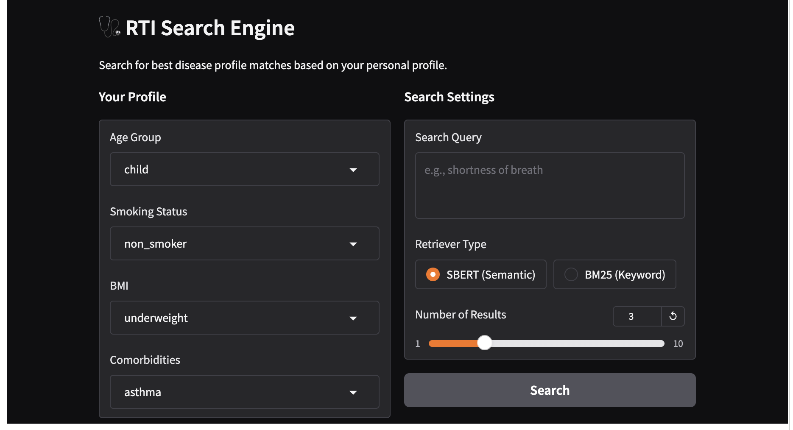

#  RTI Personalised Search Engine
**Adrielle Fuego | April 2026**

A hybrid medical information retrieval system for **Respiratory Tract Infection (RTI)** literature. Returns personalised results by combining semantic search with a demographic scoring layer, ensuring results are relevant both to the query *and* to the patient's profile.

---

## How It Works

Retrieval is a two-stage hybrid score:

```
Final Score = α × Retrieval Score + (1 − α) × Demographic Score
```

**1. Retrieval** — two methods compared:
- **SBERT** (`multi-qa-distilbert-cos-v1`): encodes queries and documents into vector space, ranked by cosine similarity
- **BM25**: classic keyword-frequency retrieval, used as a baseline

**2. Demographic Scoring** — one-hot encodes four patient dimensions and dot-products against document metadata:
| Dimension | Options |
|---|---|
| Age group | child, adult, elderly |
| Smoking status | current, ex, passive, non-smoker |
| BMI | all, obese, underweight |
| Comorbidities | asthma, COPD, diabetes, HIV, heart disease, and more |

**α = 0.5** is recommended for medical contexts (demographics as important as semantic relevance). Use α > 0.7 for general search, α < 0.3 for strict personalisation.

---

## Results

Evaluated on 5 RTI queries using a child, non-smoker, underweight, asthmatic profile:

| Metric | SBERT | BM25 |
|---|---|---|
| Precision@3 | 0.267 | 0.200 |
| MAP | 0.400 | 0.200 |
| NDCG | 0.443 | 0.281 |
| MRR | 0.500 | 0.367 |


**Key finding:** SBERT outperforms BM25 on medical queries (e.g. *"baby struggling to breathe"*), demonstrating that contextual embeddings handle clinical language better than term matching.

---

## Demo

A Gradio interface lets users set their profile and search interactively:




---

## Run It

```bash
git clone https://github.com/YOUR_USERNAME/rti-search-engine.git
cd rti-search-engine
pip install -r requirements.txt
jupyter notebook RTI_engine.ipynb
```

**requirements.txt:**
```
sentence-transformers
torch
pandas
scikit-learn
gradio
numpy
```

You will also need `ArticlesforRTI.csv` in the same directory 

---

## Tech Stack

`Python` · `Sentence-Transformers` · `PyTorch` · `scikit-learn` · `Gradio` · `Pandas` · `NumPy`

---

## Project Structure

```
rti-search-engine/
├── RTI_engine.ipynb       # Main notebook
├── ArticlesforRTI.csv     # Corpus (not included)
├── doc_embeddings.pt      # Saved SBERT embeddings (generated on first run)
├── requirements.txt
└── README.md
```
